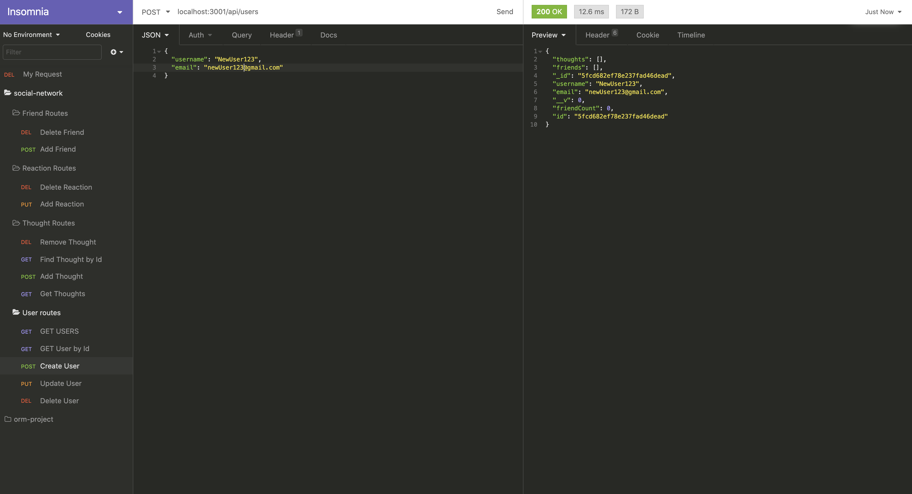
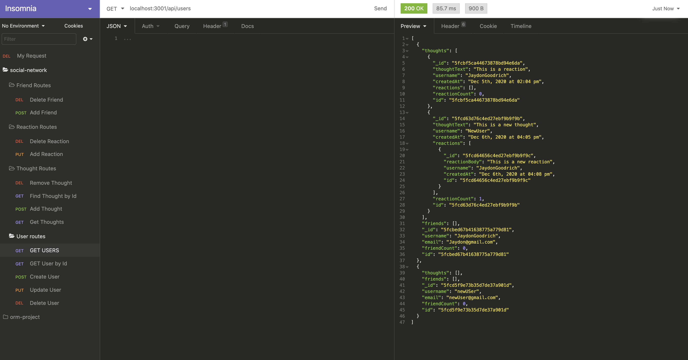

# social-network-api

## Description

A social network api that is built using MongoDB, mongoose, and an express server. This api allows a user to create, update, delete and find users from a mongoDB, as well as create, update, delete, and find thoughts from a database. Users can also create and delete reactions as well as create and delete friends. 

## Table of Contents

* [Installation](#installation)
* [Usage](#usage)
* [Contributing](#contributing)
* [License](#license)
* [Questions](#Questions)
* [Reference](#Reference)

## Installation
* Download source files

## Usage 
* Run npm install to install the dependencies
* run npm start to start the application

## Contributing

All the code for this project was written by Jaydon Goodrich

## License

Code released under the [Unlicense](http://unlicense.org/)

****

## Questions
For further questions I can be reached at:

GitHub: [Jaydon-Goodrich](https://github.com/Jaydon-Goodrich)

Email: JaydonGoodrich@gmail.com
    
## Reference
[Link to Youtube showing this project](https://youtu.be/kJdbP9EEwHI)

An Example of creating a user in the application

An example of getting all the users from the database
